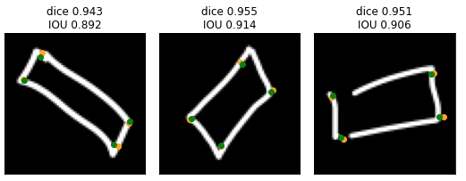

# ml_dice_and_iou
## Calculating the **accuracy** of predicted vertices on **rotated** rectangles

In Machine learning, the Dice and IOU (Intersection over Union) metrics are often used to calculate the accuracy of predictions.

For object detection, they are commonly used to compute the accuracy of the predicted bounding boxes vs the labeled boxes. But these boxes are typically not rotated.  

But when shapes are rotated like they are in the context of my app Mix on Pix, then it can be more complicated to calculate the area of a shape accurately. 

### Notebooks
- Dice and IOU coefficients: [ml_dice_and_iou.ipynb](ml_dice_and_iou.ipynb). **Note**: Also viewable from [here](https://nbviewer.jupyter.org/github/frobertpixto/ml_dice_and_iou_accuracy/blob/main/ml_dice_and_iou.ipynb). 

---
## Usage in Mix on Pix
In **[Mix on Pix](https://apps.apple.com/us/app/mix-on-pix-text-on-photos/id633281586)**, I have a model to determine the shape drawn on screen like Line, Rectangle, Ellipse, ... 

But for Rectangles, Ellipses and Triangle, I also need to determine the **vertices** (angular points) of these shapes to determine the exact position and angle. 
So, I made separate models to predict these vertices.   
To determine the accuracy of the predictions, I use the **Dice** metric.   
In the Jupyter notebook, I show examples of the vertices and how to calculates the Dice (and IOU) metrics for rotated shapes.

See also **[Mix on Pix](https://apps.apple.com/us/app/mix-on-pix-text-on-photos/id633281586)**.

 
by Francois Robert 

---
## References

- Dice: https://en.wikipedia.org/wiki/Sørensen–Dice_coefficient  
- IOU: https://en.wikipedia.org/wiki/Jaccard_index
